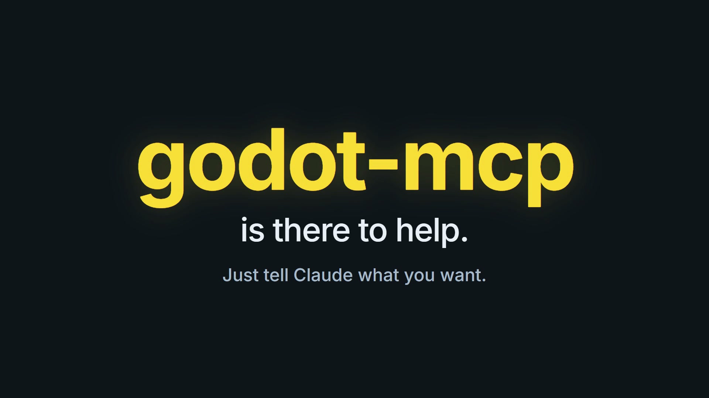

# godot-mcp

An [MCP](https://modelcontextprotocol.io) server that lets Claude (or any MCP
client) work on **Godot 4** projects: it edits `.tscn` scenes and `.gd` scripts
directly on disk, runs the project headlessly to catch errors, and can
optionally drive a *running* Godot editor over a local WebSocket bridge.

- **File tools** edit scenes and scripts on disk. They need no Godot install and
  no setup beyond building the server.
- **Live-editor tools** need the small companion plugin enabled in an open
  editor. They let Claude edit the open scene *inside* the editor — you watch
  each node appear, and Ctrl+Z undoes it — and play/stop scenes.

[](public/godot-mcp.mp4)

*New to Godot? Click the picture for a 23-second look at how godot-mcp works today.*

```
godot-mcp/
├── src/                  # the MCP server (TypeScript)
│   ├── index.ts          # tool definitions
│   ├── tscn.ts           # .tscn parser/serializer (no Godot needed to use it)
│   └── bridge.ts         # WebSocket client for the live editor bridge
├── sample-project/       # a working Godot 4 project to try the tools on
│   ├── scenes/Main.tscn
│   ├── scripts/          # player.gd (the ball), camera_rig.gd, game.gd
│   └── addons/godot_mcp_bridge/   # the live-bridge EditorPlugin
└── test/                 # `npm test`
```

The sample project is a small 3D game: roll a ball (WASD or arrow keys, Space to
jump, mouse or Q/E to orbit the third-person camera) over ramps, past boxes and
crates, to the glowing goal pad. R restarts.

## Contents

- [Quick start](#quick-start)
- [Usage guide](#usage-guide)
- [Tool reference](#tool-reference)
- [Configuration](#configuration)
- [Troubleshooting](#troubleshooting)
- [How it works](#how-it-works)
- [Known limitations](#known-limitations)
- [Development](#development)

## Quick start

Requires **Node.js 18+**.

```bash
git clone https://github.com/YasiruRF/godot-mcp.git
cd godot-mcp
npm install
npm run build
```

Register the built server with your MCP client. Use the **absolute path** to
`dist/index.js`.

**Claude Code**

```bash
claude mcp add godot -- node /absolute/path/to/godot-mcp/dist/index.js
```

On Windows use a Windows path, e.g. `node C:\dev\godot-mcp\dist\index.js`.

Or add it by hand to a project's `.mcp.json`:

```json
{
  "mcpServers": {
    "godot": {
      "command": "node",
      "args": ["/absolute/path/to/godot-mcp/dist/index.js"]
    }
  }
}
```

**Claude Desktop** — add the same `mcpServers` entry to
`claude_desktop_config.json` (macOS: `~/Library/Application Support/Claude/`,
Windows: `%APPDATA%\Claude\`), then restart the app. In JSON on Windows,
escape backslashes: `"C:\\dev\\godot-mcp\\dist\\index.js"`.

Then ask Claude something like *"List everything in the Godot project at
`/path/to/my-game`"*. If it returns your scenes and scripts, you're set.

## Usage guide

### 1. Point the tools at a project

Every file tool takes a `project_path`: the **absolute path to the folder that
contains `project.godot`**. Tools refuse to run if that file isn't there, and
they refuse to read or write anything outside the folder.

Other paths (`scene_path`, `script_path`, ...) can be given relative to the
project (`scenes/Main.tscn`), as `res://` paths (`res://scenes/Main.tscn`), or
as absolute paths inside the project. Tip for your prompts: tell Claude the
project path once ("my project is at `D:\games\platformer`") and it will reuse it.

To try things out without risking your own work, use the bundled
`sample-project/` (or a copy of it).

### 2. Build and edit scenes

Scenes are addressed by **node path**: `.` is the scene root, `Player` is a
child of the root, `Player/Ball` is a child of `Player`.

Example conversation:

> **You:** In `scenes/Main.tscn`, add an `Area3D` called `Coin` under the root
> with a `CollisionShape3D` child, and put the coin at (2, 1, -10).

Claude will call, in order:

| Call | Arguments |
|---|---|
| `add_node` | `scene_path: "scenes/Main.tscn"`, `parent_path: "."`, `name: "Coin"`, `type: "Area3D"` |
| `add_node` | `parent_path: "Coin"`, `name: "CollisionShape3D"`, `type: "CollisionShape3D"` |
| `set_node_properties` | `node_path: "Coin"`, `properties: { "position": "Vector3(2, 1, -10)" }` |

Property values are **raw Godot text**, exactly as they appear in a `.tscn`
file: `Vector2(10, 20)`, `Color(1, 0, 0, 1)`, `false`, `"a string"` (with the
quotes), `ExtResource("1_abcde")`. They are not validated, so a wrong value is
only caught when Godot loads the scene — use `run_headless` (below) after edits.

To attach a script when adding a node, pass `script_path`
(`"script_path": "scripts/coin.gd"`). The server registers the script in the
scene for you.

To start a scene from scratch, use `create_scene` first (it won't overwrite an
existing file unless you pass `overwrite: true`), then `add_node`.

> **Editor open?** Godot keeps its own in-memory copy of an open scene, so
> editing the file on disk underneath it makes the two diverge (and whichever
> is saved last wins). When the bridge plugin is running, these on-disk tools
> therefore **refuse to edit a scene that is open in the editor** and point you
> to the [live-editing tools](#5-live-editing-watch-claude-work-in-the-editor)
> (or to closing the scene's tab first). Without the plugin they can't tell, so
> save and close the scene in Godot before asking Claude to edit it on disk.

### 3. Read and edit scripts

- `read_script` returns a `.gd` file.
- `write_script` creates or **fully overwrites** a file.
- `edit_script` is a targeted find-and-replace: `old_text` must match **exactly
  once**, otherwise the call fails and nothing is changed (so include enough
  surrounding lines to make it unique).

> **You:** Open `scripts/player.gd` and add a double-jump.

### 4. Check that it actually works: `run_headless`

`run_headless` launches Godot with `--headless` on your project (or one scene),
lets it run for `timeout_ms` (default 5000), and returns everything it printed,
followed by an exit status line such as `[exit code 0]` or
`[stopped by SIGTERM after the 5000ms timeout]`. Parse errors, missing
resources and runtime errors show up in the output, which makes it a good
follow-up to any edit: *"Make that change, then run the project headlessly and
tell me if there are errors."*

It needs a Godot 4 executable. If it isn't on your `PATH` as `godot4`, set
`GODOT_BIN` (see [Configuration](#configuration)).

### 5. Live editing: watch Claude work in the editor

With the bridge plugin enabled, Claude can edit the scene **inside the running
Godot editor** instead of on disk. Each edit appears immediately in the Scene
dock and the viewport, the affected node is selected, and every edit is a step
in Godot's undo history — press **Ctrl+Z** to take it back. Nothing is written
to disk until the scene is saved (Ctrl+S, or Claude's `editor_save_scene`).

**Set up the plugin (once per project)**

1. Copy `sample-project/addons/godot_mcp_bridge/` into your project's `addons/`
   folder (or just open `sample-project/` in Godot, where it's already enabled).
2. In Godot: **Project → Project Settings → Plugins → enable "Godot MCP Bridge"**.
3. The Output panel should print
   `godot_mcp_bridge: listening on ws://127.0.0.1:9080`.
4. Ask Claude to `editor_ping`. A reply like `{"status": "alive", ...}` means the
   bridge is up.

After updating the server, also refresh the plugin copy in your project and
toggle it off and on (or reopen the project) so Godot loads the new version.

**A live session**

> **You:** Open `scenes/Main.tscn` in the editor and add a crate: a
> `StaticBody3D` at (3, 1, -20) with a 2×2×2 box collision shape and a brown
> box mesh as its visual.

Claude calls, and you watch the nodes appear one by one:

| Call | Arguments |
|---|---|
| `editor_open_scene` | `scene_path: "scenes/Main.tscn"` |
| `editor_add_node` | `parent_path: "."`, `name: "Crate"`, `type: "StaticBody3D"`, `properties: { "position": "Vector3(3, 1, -20)" }` |
| `editor_add_node` | `parent_path: "Crate"`, `name: "CollisionShape3D"`, `type: "CollisionShape3D"`, `properties: { "shape": "BoxShape3D.new()", "shape:size": "Vector3(2, 2, 2)" }` |
| `editor_add_node` | `parent_path: "Crate"`, `name: "Mesh"`, `type: "MeshInstance3D"`, `properties: { "mesh": "BoxMesh.new()", "mesh:size": "Vector3(2, 2, 2)", "material_override": "StandardMaterial3D.new()", "material_override:albedo_color": "Color(0.6, 0.4, 0.2, 1)" }` |

Not happy with it? **Ctrl+Z**. Happy? Save with Ctrl+S, or ask *"save it"*
(`editor_save_scene`). Then *"run it"* (`editor_run_scene`) to play the scene.
Claude can also read what's open (`editor_get_scene_tree`) and what you have
selected (`editor_get_selection` — *"which node do I have selected?"*).

Property values use **Godot syntax**: `Vector2(1, 2)`, `Color(1, 0, 0, 1)` (all
four components), `true`, `42`, and text **with its quotes**
(`"\"Hello\""`). For a resource property such as a collision `shape`,
`ClassName.new()` creates a fresh resource and `"shape:size"` sets a property
inside it (properties are applied in order, so set `shape` first). If any value
in a call is invalid, the whole call is rejected and nothing is changed.

Live edits act on the scene in the editor's **active tab** — use
`editor_open_scene` to switch. They work on nodes that belong to that scene
(not the internals of instanced sub-scenes).

The bridge is tested against **Godot 4.7.2**; it needs the `EditorInterface`
singleton and `WebSocketPeer.accept_stream`, so Godot 4.2 or newer is the
likely minimum. The sample project targets 4.3.

## Tool reference

### File tools (always available)

| Tool | Arguments | Purpose |
|---|---|---|
| `list_project` | `project_path` | Lists scenes (`.tscn`), scripts (`.gd`) and resources (`.tres`/`.res`), as project-relative paths |
| `read_scene` | `project_path`, `scene_path` | Parses a `.tscn` into a JSON list of nodes (`name`, `type`, `parent`, `path`, `instance`, `properties`) |
| `create_scene` | `project_path`, `scene_path`, `root_name`, `root_type`, `overwrite?` | Creates a new scene with one root node |
| `add_node` | `project_path`, `scene_path`, `parent_path`, `name`, `type`, `properties?`, `script_path?` | Adds a child node (use `"."` as the parent for the root) |
| `remove_node` | `project_path`, `scene_path`, `node_path` | Removes a node, its descendants, and any signal connections pointing at them. The root can't be removed |
| `set_node_properties` | `project_path`, `scene_path`, `node_path`, `properties` | Sets or overwrites raw properties on a node |
| `write_script` | `project_path`, `script_path`, `content` | Creates or overwrites a script |
| `read_script` | `project_path`, `script_path` | Reads a script |
| `edit_script` | `project_path`, `script_path`, `old_text`, `new_text` | Replaces exactly one occurrence of `old_text` |
| `run_headless` | `project_path`, `scene_path?`, `timeout_ms?` | Runs the project headlessly and returns its output and exit status |

Node names may not contain `. / : @ " %` or backslashes, and node types must be
plain class names such as `Sprite2D` (both are Godot rules).

### Live editor bridge (needs the plugin enabled in a running editor)

| Tool | Arguments | Purpose |
|---|---|---|
| `editor_ping` | — | Checks the bridge is reachable (returns the Godot version) |
| `editor_get_scene_tree` | — | Returns the scene open in the editor as a node tree, plus the list of open scenes |
| `editor_open_scene` | `scene_path` | Opens a scene in the editor (switches to its tab) |
| `editor_add_node` | `parent_path`, `name`, `type`, `properties?`, `script_path?`, `scene_path?` | Adds a node to the open scene — live, selected, undoable |
| `editor_set_properties` | `node_path`, `properties`, `scene_path?` | Sets properties on a node in the open scene — live, undoable |
| `editor_remove_node` | `node_path`, `scene_path?` | Removes a node and its descendants from the open scene — live, undoable |
| `editor_save_scene` | — | Saves the open scene to disk (like Ctrl+S) |
| `editor_run_scene` | `scene_path` (`res://...`) | Presses "Play Scene" on that scene |
| `editor_stop` | — | Stops the running scene |
| `editor_get_selection` | — | Returns the node path(s) currently selected in the editor |

`scene_path` on the live-edit tools is an optional safety check: the call fails
unless that is the scene currently open. Values use Godot syntax (see
[Live editing](#5-live-editing-watch-claude-work-in-the-editor)).

## Configuration

| Variable | Default | Meaning |
|---|---|---|
| `GODOT_BIN` | `godot4` | Godot 4 executable used by `run_headless` |
| `GODOT_MCP_BRIDGE_URL` | `ws://127.0.0.1:9080` | Where the `editor_*` tools look for the bridge |

Set them in your MCP client config, for example:

```json
{
  "mcpServers": {
    "godot": {
      "command": "node",
      "args": ["/absolute/path/to/godot-mcp/dist/index.js"],
      "env": { "GODOT_BIN": "C:\\Godot\\Godot_v4.3-stable_win64_console.exe" }
    }
  }
}
```

On Windows, prefer the `_console.exe` build of Godot for `run_headless` — it
attaches stdout/stderr so errors show up in the output.

The bridge's port is fixed at `9080` in
`sample-project/addons/godot_mcp_bridge/godot_mcp_bridge.gd` (`PORT`); if you
change it there, change `GODOT_MCP_BRIDGE_URL` to match.

## Troubleshooting

| Symptom | Cause / fix |
|---|---|
| `No project.godot found in "..."` | `project_path` must be the folder that *contains* `project.godot`, as an absolute path |
| `Refusing to access a path outside the project folder` | A `scene_path`/`script_path` resolved outside `project_path` (for example via `..`). Use a path inside the project |
| `Could not launch "godot4": spawn godot4 ENOENT` | Godot isn't on `PATH` under that name. Set `GODOT_BIN` to the executable |
| `run_headless` output is empty on Windows | Use the `_console.exe` Godot build |
| `Could not reach the Godot editor bridge ... ECONNREFUSED` | Godot isn't open, or the plugin isn't enabled (Project Settings → Plugins). File tools still work without it |
| Plugin logs `failed to listen on 127.0.0.1:9080` | Another Godot editor (or program) already holds the port — close it |
| `old_text matched N times; make it unique` | Add more surrounding lines to `old_text` in `edit_script` |
| Edits don't show in the open editor | Godot caches open scenes; accept its "reload from disk" prompt |
| `... is open in the Godot editor, so editing the file on disk would desync it` | Deliberate guard. Use `editor_add_node` / `editor_set_properties` / `editor_remove_node`, or close that scene's tab in Godot first |
| `'...' is not the scene currently being edited` | Live edits act on the editor's active tab. Call `editor_open_scene` first |
| `could not parse '...' as a Godot value` | Use Godot syntax: `Vector2(1, 2)`, `Color(1, 0, 0, 1)` (4 components), `true`, `42`, and text with quotes |
| `... is GDScript, not scene-file syntax` | `RectangleShape2D.new()` only works in live edits (`editor_add_node`). In a scene file on disk, a resource must be a `SubResource(...)` |
| `unknown command: add_node` (or another new command) | Your project has an older copy of the plugin. Re-copy `addons/godot_mcp_bridge/` and toggle the plugin off and on |
| Claude can't see the tools | Check the path in your MCP config is absolute and points at `dist/index.js`, that you ran `npm run build`, and restart the client |

## How it works

Godot doesn't expose an API for external processes to control it, so the
project splits into two independent halves:

- **File-based tools.** `.tscn` and `.gd` files are plain text. The server
  parses and writes them directly, so these tools work with *zero* Godot-side
  setup — you don't even need Godot installed, except for `run_headless`. The
  `.tscn` handling is conservative: it edits the blocks it needs and keeps
  everything else in the file verbatim, so an edit produces a small diff and an
  untouched scene round-trips byte for byte.
- **Live editor bridge.** A small `EditorPlugin`
  (`sample-project/addons/godot_mcp_bridge/`) runs inside the Godot editor and
  opens `ws://127.0.0.1:9080`. The `editor_*` tools connect to it, send one JSON
  command (`{"id", "command", "args"}`) and read one JSON reply
  (`{"id", "ok", "result", "error"}`). Scene edits go through the editor's
  `EditorUndoRedoManager` on the scene that is actually open, which is why they
  show up live and can be undone. The on-disk tools ask the bridge whether a
  scene is open before touching its file, and refuse if it is.

## Known limitations

- The `.tscn` parser handles nodes, ext/sub resources and single-line
  properties. Properties whose values span several lines (some dictionaries and
  arrays) are preserved when untouched, but `read_scene` only shows their first
  line and `set_node_properties` can't replace them reliably. Do those edits in
  the Godot editor.
- Property values and node types are not validated against Godot's class
  database — run `run_headless` after edits.
- `run_headless` and the live bridge need a local Godot install; the other
  tools don't.
- The live bridge has no authentication. It binds to `127.0.0.1` only, but any
  local program — and potentially a web page in your browser, since browsers
  allow WebSocket connections to localhost — can send it commands while the
  plugin is enabled. Those commands can change (undoably) and save the open
  scene. Enable the plugin while you use it, and never expose the port on a
  shared or public host.
- Live edits act on the scene in the active editor tab, on nodes that belong
  to it (not the internals of instanced sub-scenes). There is no MCP-side undo;
  use Ctrl+Z in the editor.
- Tested against Godot 4.7.2: the bridge plugin was run end to end in a real
  (headless) Godot editor, and `run_headless` with the real binary. Those runs
  are manual, not part of `npm test`, which uses stand-ins (a mock WebSocket
  server and a fake binary). Older Godot 4 versions are untested.

## Development

```bash
npm install
npm test        # builds, then runs the test suite (no Godot required)
npm run dev     # tsc in watch mode
```

The tests cover the `.tscn` round-trip and edit operations, drive the built
server over the real MCP stdio protocol against a scratch copy of
`sample-project/`, and check the bridge client against a mock of the plugin's
WebSocket protocol.

Ideas for later: `instance_scene` (instance one `.tscn` in another),
`editor_call_method`, signal connection editing, export-preset management.
